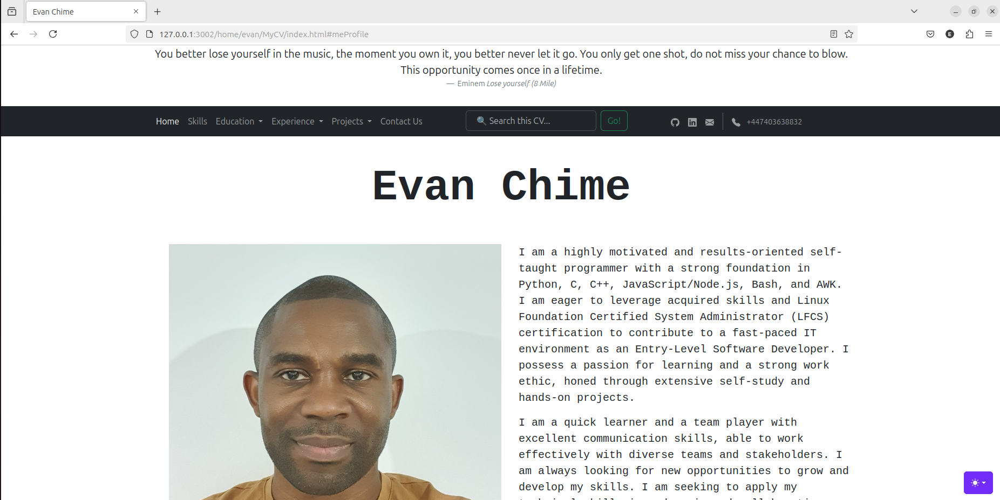

# MyCV

## Description
My personal webpage that acts as an online CV. It's my way of introducing 
myself to you. It includes my short bio, contact details, list of skills and 
competencies, education, work experience, projects etc

## Table of Contents
- [Installation](#installation)
- [Usage](#usage)
- [Contributing](#contributing)
- [License](#license)
- [Credits](#credits)

## Installation
To install the MyCV project locally, follow these steps:
1. Clone the repository:
    ```bash
    git clone https://github.com/evanchime/MyCV.git
    ```
2. Navigate to the project directory:
    ```bash
    cd MyCV
    ```
3. Open `index.html` in your preferred web browser.

## Usage
After installing the project, open `index.html` in your web browser to view my 
personal webpage. You can navigate the page through the navigation bar, change 
the color mode in the bottom right of the page. You can get in contact on the 
phone or via the email or linkedin icon, or check out my github by clicking on 
the github icon. You can also checkout any of the projects on github, by 
clicking on the project name. Click on the Linux Foundation Certified System 
admin badge, to verify  



## Contributing

Contributions are welcome! See the [CONTRIBUTING](CONTRIBUTING.md) file for 
more information.

## License

This project is licensed under the MIT License. See the [LICENSE](LICENSE.md) 
file for more information.

## Credits
This project was created with the help of:
- [Bootstrap and it's contributors](https://getbootstrap.com/)
